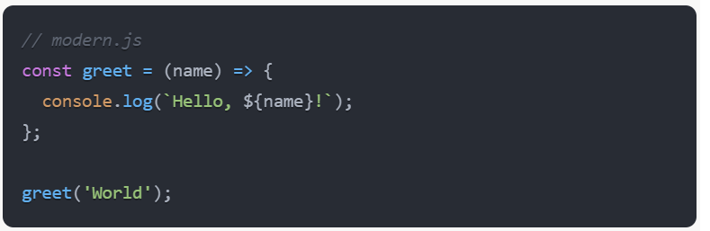
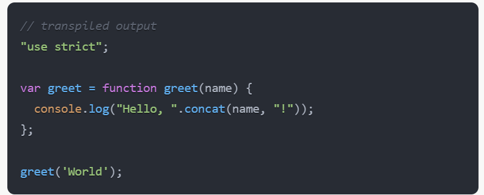
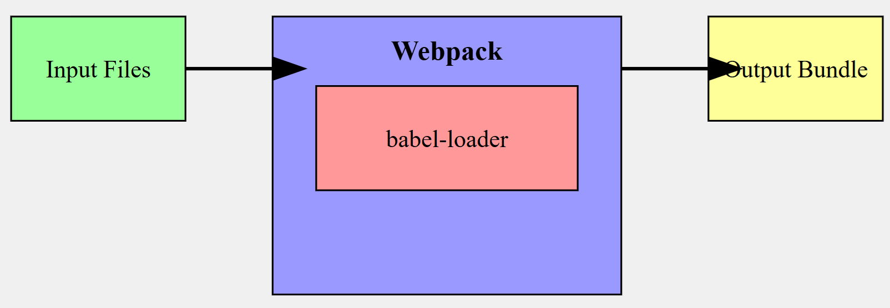

# Babel Integration with Webpack via Loaders

Babel integrates with webpack through the use of loaders, specifically the **babel-loader**. This integration allows webpack to use Babel to transpile JavaScript files during the bundling process.

## Loader Concept in Webpack

Loaders in webpack are transformations that are applied to source files as they are added to the dependency graph. They allow webpack to process more than just JavaScript files (e.g., converting TypeScript to JavaScript, or inline images to data URLs).

## Babel-Loader

The babel-loader is a webpack loader that allows transpiling JavaScript files using Babel and webpack. It takes modern JavaScript code and transforms it into a backwards compatible version that can run in older environments.

## Example

Let's say you have a modern JavaScript file using arrow functions and const:

When webpack processes this file with babel-loader, it will be transpiled to:

## Visual Representation

Here's a simplified visual representation of how Babel integrates with webpack:

