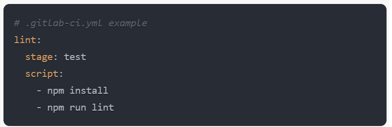
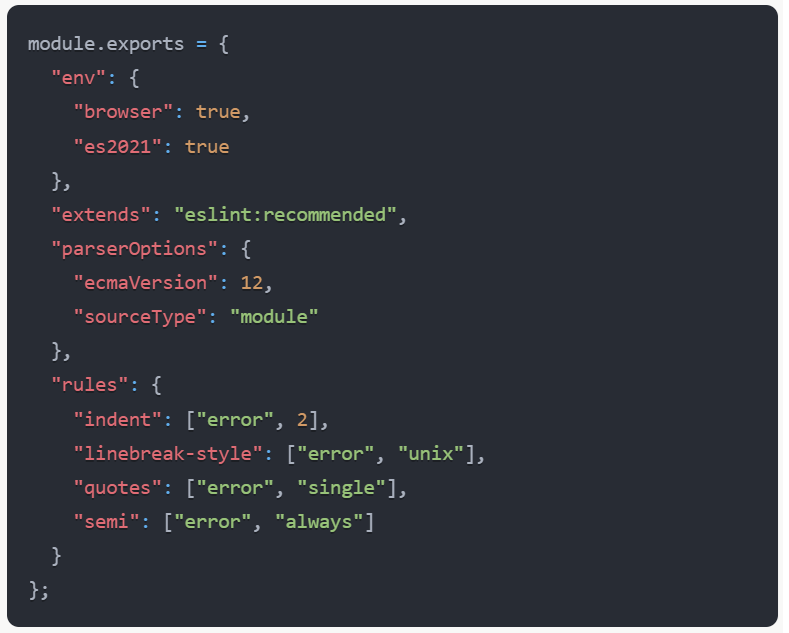
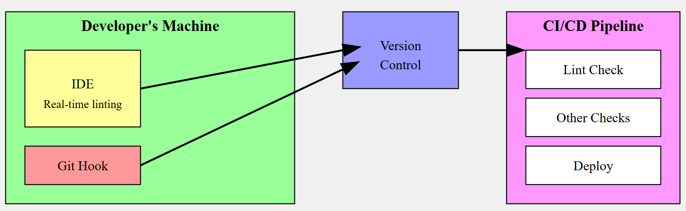

# ESLint Integration with Development Workflow and IDEs

ESLint is a powerful tool for identifying and fixing problems in JavaScript code. Its integration into the development workflow and IDEs can significantly improve code quality and consistency.

## Development Workflow Integration

### Local Development

    1. Command Line Interface (CLI): Developers can run ESLint manually from the command line.
    2. Git Hooks: Using tools like Husky, ESLint can be set up to run automatically before commits.

### Continuous Integration (CI)

ESLint can be integrated into CI pipelines to ensure that all code being merged into the main branch adheres to the defined standards by writing custom **YAML**

### IDE Integration

Most modern IDEs and code editors provide ESLint integration, which offers real-time linting as you type. This immediate feedback helps developers catch and fix issues quickly.

**Examples of IDE Integrations:**

    1. Visual Studio Code:

        1. Install the ESLint extension
        2. Configure settings.json

    2. WebStorm:

        1. ESLint is supported out of the box

### Configuration

ESLint is highly configurable. You can set up rules in a **.eslintrc.js** file:

## Visual Representation

Here's a diagram showing how ESLint integrates into the development workflow:

