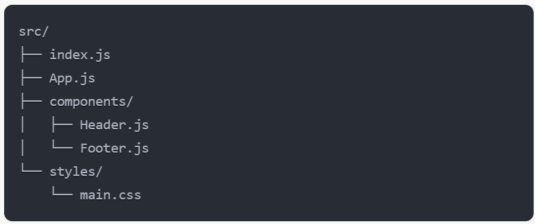
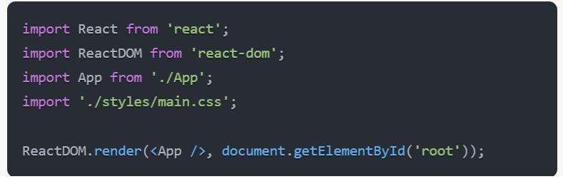
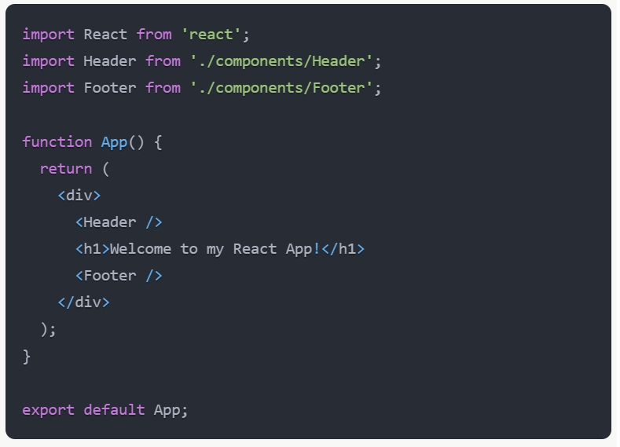
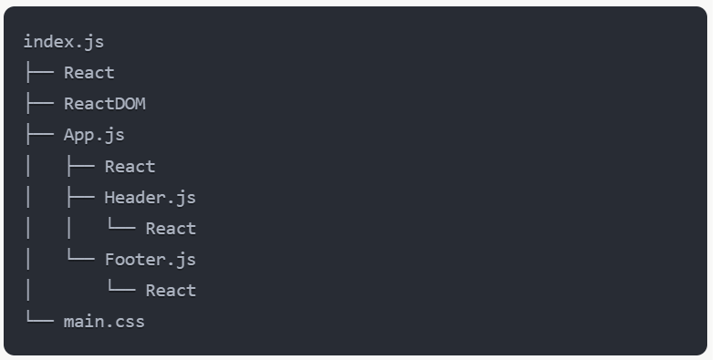

# Webpack Dependency Graph and Module Bundling

Webpack creates a dependency graph and bundles modules through a process that can be broken down into several steps:

1. **Entry Point**: Webpack starts from a specified entry point, typically your main JavaScript file.

2. **Parsing**: It parses this file, looking for import statements and other dependencies.

3. **Resolving**: For each dependency found, webpack resolves its location on the file system.

4. **Parsing Dependencies**: It then parses these dependencies, repeating steps 2-4 recursively for each module.

5. **Creating the Graph**: As it goes through this process, webpack builds an internal dependency graph, connecting all your application's modules.

6. **Bundling**: Finally, based on this graph, webpack bundles all the relevant modules into one or more output files.

## Example

Let's consider a simple React application structure:

1. Starting with `index.js` as the entry point:

2. Webpack parses this file and finds dependencies: React, ReactDOM, App, and main.css.

3. It resolves these dependencies:

   - React and ReactDOM in node_modules
   - App.js in the same directory
   - main.css in the styles directory

4. It then parses App.js:

5. This process continues for Header.js and Footer.js.

6. The resulting dependency graph might look something like this:

7. Webpack then bundles these modules, applying necessary transformations (via loaders like babel-loader for JSX, css-loader for CSS), and produces one or more output files.

## Visual Representation

Here's a simplified visual representation of this process:

